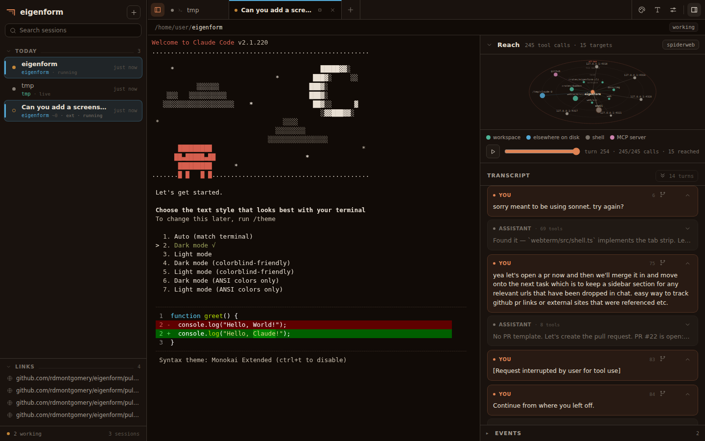

# eigenform

> manuscripts don't burn.

A control surface over Claude Code (and imported Claude Chat) that performs context surgery, manages a session forest, and surfaces the eigenforms across a body of work.

The binary is `eigenform`; alias it to taste (`alias ef=eigenform`). Dual-licensed [MIT](LICENSE-MIT) OR [Apache-2.0](LICENSE-APACHE).



## What you get

One local daemon, one browser tab, every Claude Code session you have.

- **A real terminal, tabbed.** Full-fidelity xterm sessions hosted by the daemon — they survive a closed browser, a reload, a dropped socket. Tabs drag, restore by session uuid, and reconnect on their own.
- **The rail.** Every session on disk, live or not, ranked by state and recency, with shape-coded status dots (working / ready / external / headless), search, inline rename, a fuzzy launcher for new sessions, and a Links section that collects the URLs mentioned in chat.
- **Transcript + reach map.** A docked drawer renders the session semantically — turns, tool calls, mini-diffs — alongside a reach map of how far the agent's hands stretched — subdirs, sibling repos, web hosts, MCP servers, subagents — with a secret-read-then-egress pair flagged.
- **Context surgery.** Edit any past prompt and fork: a copy-on-write branch is written beside the original (never touched), resumed in a new tab, with your edited prompt staged in the input — **never sent**.
- **Audit panes.** Active-sessions modal (what Claude *thinks* is running vs. what is), an events stream, and an inspect view of the skills and memory layers each project actually sees.

- **Codex workers.** OpenAI Codex CLI threads join the rail (tagged `codex`) with transcript and reach map. A worker Claude spawned nests under the Bash call that started it, and double-clicking a thread opens `codex resume` in a tab, refused while a worker still holds it. The [`codex-worker`](.claude/skills/codex-worker/SKILL.md) skill gives Claude the delegate → verify → correct loop; `just install-codex-skill` makes it available in every repo. Design: [`docs/plans/2026-10-02-codex-workers-design.md`](docs/plans/2026-10-02-codex-workers-design.md).

- **Artifact pane.** What the session *made*: HTML, SVG, markdown and images it wrote, rendered in a split beside the terminal. It follows the newest write (or you pin one) and reloads as the agent edits, including files a subagent or Codex worker wrote. Each artifact runs in a sandbox with an opaque origin, so agent-written pages can't reach the daemon's API or the pty socket. On a markdown plan, the pencil switches to **annotate**: select text to comment, strike, or replace it, then **Stage in terminal** types the compiled critique into the input. It is never sent; you review it and press Enter. Opt in to the **plan gate** (`eigenform plan-gate` prints the hook) and Claude's plan approval comes to the pane: annotate, then Approve or Send back, with your marks as the feedback. If eigenform isn't running, Claude Code shows its usual prompt.

Nothing leaves your machine. The daemon reads `~/.claude` (and `~/.codex`); it never calls an API.

## Install & run

eigenform is a single local daemon that serves a browser app and hosts your Claude Code pty sessions. Install it once and the app is baked into the binary — no Node, no build step, no flags:

```sh
just install        # builds the frontend, then `cargo install` with assets embedded
eigenform           # starts the daemon and opens the app in your browser
```

`eigenform` with no arguments is the one-command launch: if a daemon is already running it just opens the browser; otherwise it starts the daemon **in the background** (port 4317), opens the app, and returns your terminal. The daemon outlives the launching shell on purpose — it hosts your Claude sessions, so closing the terminal must not kill them. Run it again any time to reopen the app; it won't start a second daemon.

```sh
eigenform           # launch (or reopen) the app — backgrounds the daemon
eigenform status    # is a daemon running? (pid + version)
eigenform stop      # shut the daemon down (ends the sessions it hosts)
```

For a foreground daemon (dev, debugging, scripting) use the explicit `eigenform daemon` (`--port`, `--open`, `--cmd`, `--workspace`, `--dev`); there `Ctrl-C` stops it. Background logs go to `~/.eigenform/state/daemon.log`. The pty spawns your `$SHELL`; **`claude` is only ever launched from inside the app**, never by the daemon.

### Prerequisites

- **[Rust](https://rustup.rs)** toolchain (`cargo`) — builds the binary.
- **[Node](https://nodejs.org)** — only at build time, to bundle the frontend.
- **[`just`](https://github.com/casey/just)** — a command runner. If you know `make`, `just` is the same idea: the [`justfile`](justfile) holds named recipes (`install`, `run`, `dev`, `test`) and `just <recipe>` runs one. It's simpler than `make` — recipes are plain shell, no tabs-vs-spaces, no build-graph. Install it with:

  ```sh
  cargo install just          # any platform (you already have cargo)
  # or: brew install just · apt install just · scoop install just
  ```

  Then `just --list` shows every recipe. `cargo install` builds a release binary with `--features embed-assets`, which is what makes it self-contained.

Prefer not to install `just`? The recipes are thin — run the underlying commands yourself:

```sh
cd webterm && npm install && npm run build && cd ..        # = just build
cargo install --path crates/eigenform-cli --features embed-assets --locked   # = just install
```

### Alias `ef`

The binary is `eigenform`; most people alias it to `ef`. Add it to your shell rc:

```sh
echo 'alias ef=eigenform' >> ~/.zshrc   # or ~/.bashrc
source ~/.zshrc
```

Then `ef` launches the app and `ef daemon`, `ef sessions`, `ef surgery …` all work.

## Develop

```sh
just dev            # esbuild --watch + cargo-watch: edit .ts → browser reloads, .rs → daemon restarts
just run            # one-shot: build the app, run the daemon, open the browser
just test           # Rust workspace + webterm unit tests (never spawns claude)
just fmt            # rustfmt the workspace — CI rejects unformatted Rust
```

In a dev checkout the daemon serves the frontend from disk (`webterm/dist`), so you don't rebuild the binary to see UI changes — `just dev` rebuilds the bundle and live-reloads the page.

## Status

Early but running. The browser app — a full-fidelity terminal centerpiece with a session host, launcher, and transcript drawer — is implemented and self-contained via `just install`. The context-surgery, forest, render, skills, memory, and inspect crates are built and tested; the eigenform graph is still ahead. The original design is at [`docs/plans/2026-06-02-eigen-foundation-design.md`](docs/plans/2026-06-02-eigen-foundation-design.md), and spike notes (load-bearing empirical claims) live in [`notes/spikes/`](notes/spikes/).

## What this is

Three operations, one dialectic:

- **Fork** *negates* — context surgery on a session: branch, rewind, edit-then-fork, inject a synthetic turn.
- **Recent-work surfacing** *preserves* — a session forest indexed by project, time, keyword, and semantics.
- **Eigenform graph** *elevates* — a hypergraph whose edges name shared fixed-point structures across surface-disparate threads.

The Aleph is the failure mode (all-seeing as simultaneity = paralysis). Coarse-graining is the cure (all-seeing as recall = help). Every feature serves resumption, forking, recall, or reframing.

## What this is not

- Not a terminal multiplexer.
- Not a generic token dashboard.
- Not an SDK/`--print` engine. The interactive `claude` pty is the engine; everything else is off-path enrichment.

## How to read this repo

1. Start with [`docs/plans/2026-06-02-eigen-foundation-design.md`](docs/plans/2026-06-02-eigen-foundation-design.md).
2. Then [`notes/spikes/`](notes/spikes/) — what we've verified empirically, what's pending, what would falsify the design.
3. Then [`justfile`](justfile) — the canonical commands. Engine-touching targets are human-triggered.
